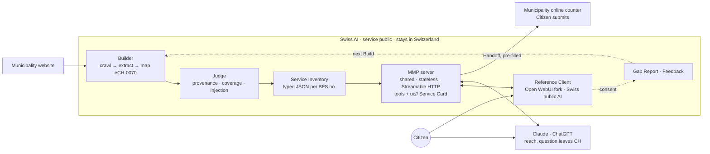

# MMP Architecture

The accepted architecture decisions and shared language for the Model Municipality Protocol (MMP): public infrastructure that makes Swiss municipality services reachable through chat, running on Swiss public AI so citizens' questions never have to leave the country.

This folder is the canonical design record for the project — promoted here from `ideas-dominik/` so any workstream (Scout ingestion, the MCP Factory, the reference client) builds against the same accepted decisions instead of a personal notes folder.

## Contents

- [`CONTEXT.md`](CONTEXT.md) — glossary (ubiquitous language: Build, Judge, Service Inventory, Withheld Attribute, Build Floor, Handoff, ...). Use these terms in code, docs and slides.
- [`adr/`](adr/) — architecture decisions (all `status: accepted`)
- [`OPEN-QUESTIONS.md`](OPEN-QUESTIONS.md) — decisions deliberately deferred (OQ-1 municipality sign-off, OQ-2 public-model tool-calling reliability)
- [`judge-rubrics.md`](judge-rubrics.md) — outline of the six candidate Judge rubrics (three implemented in `pipeline/judge/`, three proposed), for team review

## ADRs and where they stand against current work (2026-09-24)

**Update (branch `feat/mmp-mvp`):** `mmp/` is an end-to-end MVP built directly against these ADRs — typed v1 Service Inventory, one shared stateless MMP server by BFS number, the Judge wired into the Build, and a Reference Client with its own MCP Apps host rendering the Service Card. See `mmp/README.md` ("How the ADRs show up in code" and "Deliberate decisions to review"). The table below describes `pipeline/` and is unchanged.

The team's `pipeline/` workstream (Scout ingestion, the Judge, and handoff data) moved fast while these ADRs sat unreferenced in a personal folder. None of them have been formally contradicted; the Judge (0004, 0007) now has a running skeleton, several others are still not implemented, and one is actively at risk. Re-check this table as `pipeline/` matures — don't treat it as permanent.

| ADR | Decision | Status vs. current `pipeline/` work |
|---|---|---|
| [0001](adr/0001-ech-0070-as-canonical-service-model.md) | eCH-0070 is the canonical Service model | Still the target. Scout's build plan explicitly defers universal eCH-0070 mapping for now — a known gap, not a rejection. |
| [0002](adr/0002-sovereignty-is-offered-by-the-client-not-enforced-by-the-protocol.md) | Sovereignty lives in the reference client, not the protocol | Untouched — no reference-client work has started. Current handoff docs treat Claude/ChatGPT/Open WebUI as interchangeable generic hosts; that's fine for the protocol, but the sovereign reference client itself doesn't exist yet. |
| [0003](adr/0003-a-build-produces-data-not-code.md) | A Build produces data, not code; one generic MMP server | **At risk.** The `service-implementation` branch has an LLM generating per-service Python tools, including action tools that submit forms — a direct contradiction. Needs an explicit team decision, not a default-wins-by-inertia outcome. |
| [0004](adr/0004-zero-maintenance-at-the-municipality.md) | Zero maintenance at the municipality; the Judge is the only quality gate | **Implemented (skeleton).** `pipeline/judge/` runs three pass/fail/withheld checks — provenance, injection/safety, coverage/Build Floor — as an independent subproject with its own CLI (`uv run judge`, see `pipeline/judge/README.md`). Not yet wired into a real Build pipeline; the intended OpenAI+Apertus ensemble currently runs single-model since Apertus access isn't provisioned. `pipeline/EVALS.md` / `pipeline/PROVENANCE_AND_TRUST.md` (Scout's own metrics/evidence-classification notes) are a useful input to sharpen this further, not a substitute for it. |
| [0005](adr/0005-stateless-server-no-citizen-query-logs.md) | Stateless server, no citizen query logs | Not yet relevant — no runtime/server work has started. Re-check once the MCP server itself is built. |
| [0006](adr/0006-reference-client-is-a-fork-of-open-webui-with-own-mcp-apps-host.md) | Reference Client = Open WebUI fork with own MCP Apps host | Not yet relevant — no client work has started. |
| [0007](adr/0007-service-inventory-is-typed-data-with-injection-check.md) | Service Inventory is typed data, with a separate injection check | **Implemented.** `pipeline/judge/injection.py` runs deterministic checks (foreign-domain links, payment details, instruction-injection keywords) with an LLM-ensemble fallback for free-text fields; a flag always withholds, never just warns. Still compatible with and extendable by `pipeline/PROVENANCE_AND_TRUST.md`'s evidence/classification model. |

## On Patrick's plan and the delivered data

`ideas-patrick/hackathon-mvp-plan.md` and the fixed-7-tool "Factory" design driven from it are **not** treated as authoritative for this architecture. This now also covers `publicai/`, the self-contained Factory MVP subproject built from that plan — it hasn't been evaluated against this table and shouldn't be assumed to settle any of the ADRs above. The municipality inventories already delivered under `pipeline/legacy/handoff/delivery-2026-09-24/` (Ausserberg, Binn, Bosco/Gurin, Ilanz/Glion, Biel/Bienne, Lausanne, Lugano, Zürich) are kept regardless, as reference data/examples of the target Service Inventory shape — independent of which plan produced them.

## Architecture at a glance

## Visuals

User journey mockup ("Umzug nach Seewil", 5 screens) plus architecture and journey-under-the-hood slides live on a design canvas: https://claude.ai/artifact/7xWdCAZzYjQFaBZn7HrVr5 (ask Dominik for access).
