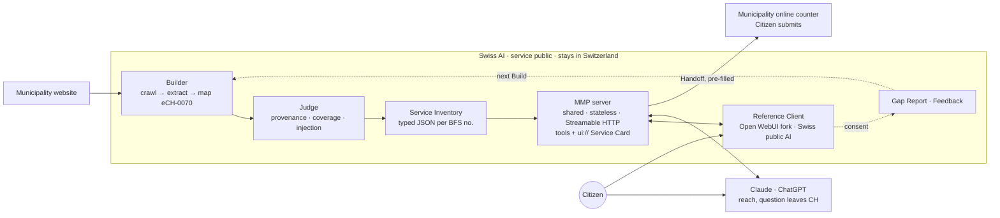

# Model Municipality Protocol (MMP) — ideas (Dominik)

Makes the information and services of Swiss municipalities reachable through chat and a standardized UI, running on Swiss public AI so that citizens' questions stay in Switzerland — built for small Gemeinden with no IT staff.

## Contents

- [`CONTEXT.md`](CONTEXT.md) — glossary (ubiquitous language). Use these terms in code and slides.
- [`docs/adr/`](docs/adr/) — architecture decisions
  - [0001](docs/adr/0001-ech-0070-as-canonical-service-model.md) eCH-0070 is the canonical Service model; the shared schema is the protocol
  - [0002](docs/adr/0002-sovereignty-is-offered-by-the-client-not-enforced-by-the-protocol.md) Sovereignty is offered by the Reference Client, not enforced by the protocol
  - [0003](docs/adr/0003-a-build-produces-data-not-code.md) A Build produces data, not code; one shared MMP server
  - [0004](docs/adr/0004-zero-maintenance-at-the-municipality.md) Zero maintenance at the Municipality; the Judge is the only quality gate
  - [0005](docs/adr/0005-stateless-server-no-citizen-query-logs.md) Stateless server, no Citizen query logs
  - [0006](docs/adr/0006-reference-client-is-a-fork-of-open-webui-with-own-mcp-apps-host.md) Reference Client = Open WebUI fork with own MCP Apps host
  - [0007](docs/adr/0007-service-inventory-is-typed-data-with-injection-check.md) Service Inventory is typed data, with injection check
- [`docs/OPEN-QUESTIONS.md`](docs/OPEN-QUESTIONS.md) — OQ-1 Municipality sign-off · OQ-2 public model tool calling (test first!)

## Architecture at a glance

## Visuals

User journey mockup ("Umzug nach Seewil", 5 screens) plus architecture and journey-under-the-hood slides live on a design canvas: https://claude.ai/artifact/7xWdCAZzYjQFaBZn7HrVr5 (ask Dominik for access).
